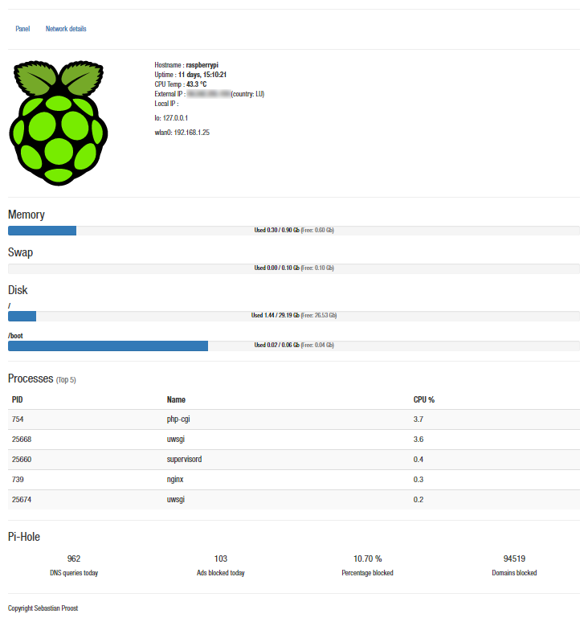

 

# Flask-Server-Panel and API

Server panel based on flask to show stats for a small private server. 
Designed specifically with a [Raspberry Pi](https://www.raspberrypi.org/) 
running [Pi-Hole](https://pi-hole.net/) in mind.

The API that is queried by the front-end is located at <your_url>/api/. 
For details check out the [API documentation](./docs/api.md).

The back-end is based on Python [Flask](http://flask.pocoo.org/) with a 
front-end using [React.js](https://facebook.github.io/react/) and 
[Bootstrap](http://getbootstrap.com/)

*Note: The Raspberry Pi logo changes color along with the temperature. 
Green is good, red means you have to invest in a new case with better 
cooling.*

## Getting started

Installation instruction for deployment on a linux system. 

Clone the repository

    git clone https://github.com/sepro/Flask-Server-Panel.git Flask-Server-Panel
    
Set up a virtual environment
    
    cd Flask-Server-Panel
    virtualenv --python=python3 venv
    
Activate the environment and install packages

    source venv/bin/activate
    pip install -r requirements.txt
    
Configure Flask-Server-Panel

    vim config.py

Run tests and run app

    python run_tests.py
    
    python run.py

## Developing the front-end
Install all packages through npm 

    npm install

Build ./serverpanel/static/js/bundle.js using webpack

    webpack -p

